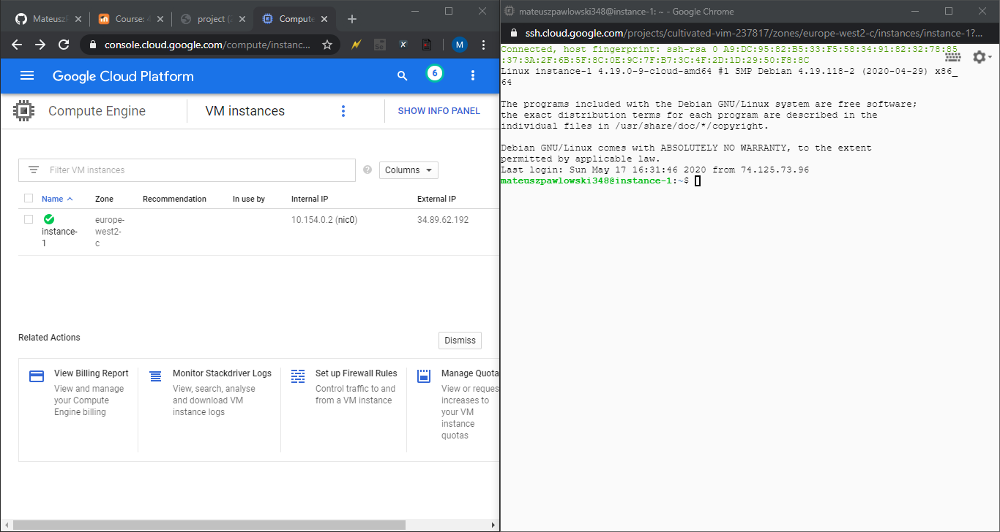
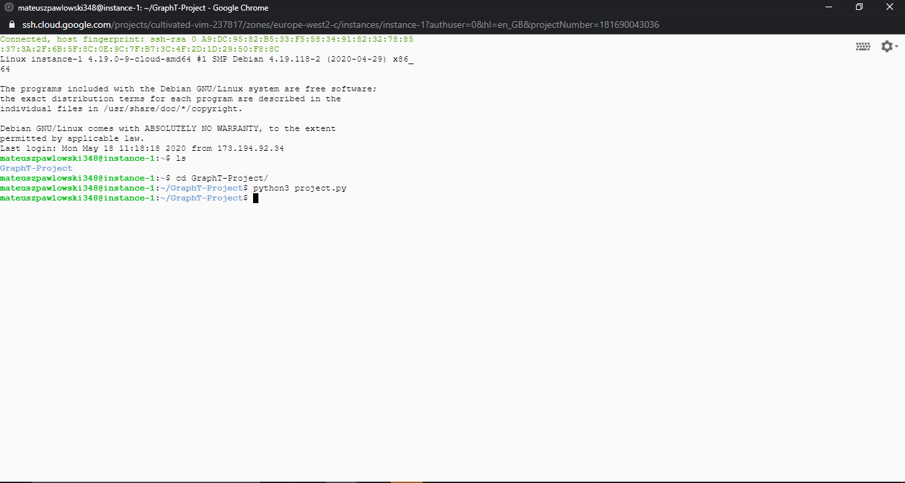
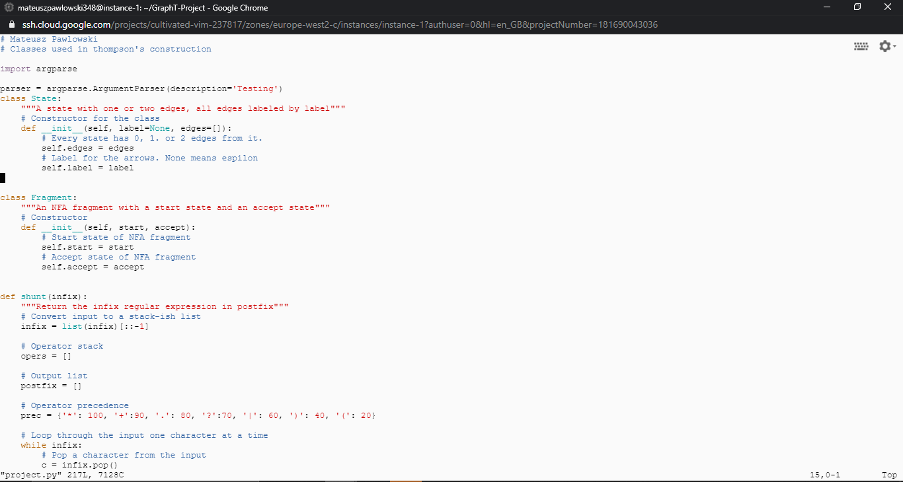
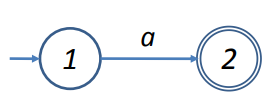
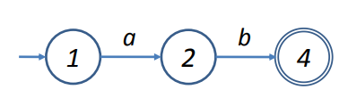
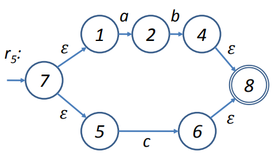
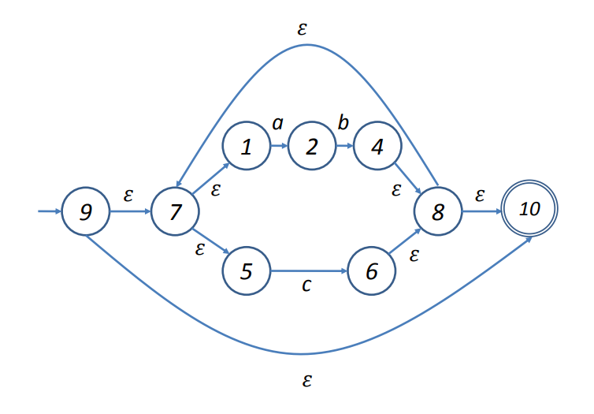

# Introduction
This is my year 3 project for graph theory. It is a program to execute regular expressions on strings using an algorithm known as Thompson’s construction. We learned about this throughout the year, so we have a fair bit of understanding of how this algorithm works and how to execute it. The shunting algorithm is used in this piece of code which is used together with the Thompson’s construction. The language used for this project is python3 as it is a very simple language and quite easy to learn. The whole project can be found on my GitHub with this link provided: https://github.com/MateuszPawlowski/GraphT-Project.  We created ourselves a virtual machine on the google cloud and we coded the whole program on that virtual machine. For the virtual machine we used the European servers (London) and for the Boot disk we used Debian 10Debian GNU/Linux 10 (buster). The rest of the options for the virtual machine we left as normal, but feel free to change it up to your liking. Once you create a virtual machine, you have to wait for a few minutes before it completes to build. When fully built the virtual machine will be turned on and to access it you go to the right-hand side of the machine and press the SSH button under connect. This will load and open the virtual machine as shown on the image. When you are done using the virtual machine you can press the X button on the top right-hand side of the tab or type in ‘exit’ into the command line. Make sure whenever you are finished working with the virtual machine, you turn it off. In order to do that, just beside connect to the right you will see these three dots. If you press them you can stop the virtual machine from running in order to not loose your credits. Once stop is pressed it will take few seconds for the machine to turn off and you will get a notification saying the machine is stopped now. To turn it back on you do the same thing as for stop but press the start button and wait for the machine to be turned on. You will see it working when there is going to be a green tick arrow as seen in the image provided.  

# Run
In order to run this program, there are some steps before hand you need to complete to get it working. As said before, first you have to go into the GitHub link provided and copy the link. Once that is done, turn on your virtual machine and press the SSH button. Once the virtual machine is turned on there are a few things you need to download before cloning the repository. First this is what you need to update and upgrade the virtual machine, in order to do that you do: 
- sudo apt update – sudo (superuser) is the package manager for Debian. This will go to the package list online and download the newest updates to be on the newest version. 
-	sudo apt upgrade – after downloading the packages in order to upgrade you type in this command. You will get a message saying are you sure you want to continue. You can press enter because Yes is the default, or you can type in ‘Y’.  

After the upgrade completes, there are some handy tools you have to download like git, vi and others. There is a way to see if you already have some of these tools downloaded and I will show you how to check that.  
- git --version – to check if git is installed.  
- vi --version – to check if vi is installed.  
- python3 --version – to check if python3 is installed.  
- gcc --version – to check if gcc is installed, gcc is the standard C compiler.  

In my virtual machine I had vi and python3 already installed. But if your virtual does not have them installed you can look up online or just copy the code that I will use to install git and change git to ‘vi’ or ‘python3’. In order to install git and gcc we will write:
-	sudo apt install git – this will download git. You will get a message saying are you sure you want to continue. You can press enter because Yes is the default, or you can type in ‘Y’.
-	sudo apt install build-essential – this will download gcc. You could write sudo apt install gcc, however that is not the recommended way. Build-essential is a meta package, it is a collection of pieces of software.  

You might also want something for downloading files, for this you can get wget or curl.  
- wget --version – to check if wget is installed.  
- curl --version – to check if curl is installed.  

To download you will say:  
-	sudo apt install wget – to install wget onto your virtual machine.
-	sudo apt install curl – to install curl onto your virtual machine.  

Whilst all that is done you are ready to clone the repository. So with the link from GitHub go to your virtual machine and type in git clone (link) https://github.com/MateuszPawlowski/GraphT-Project. A new folder will be created on the virtual machine called GraphT-Project. In order to get into that directory, you will type in cd GraphT-Project. You can check if that worked by typing in ‘ls’ into the command line. If you see few programs like myscript.py, project.py and shunting.py you know you are in the good directory. To run the main project, you will type in:  
- python3 project.py – to run the main program.  
- vi project.py – to look at the code of the program. In order to edit the program, you will have to press i and on the bottom left-hand side you will see insert meaning now you can insert your own code into the program. To save you press Escape and after press :wq.  
**Run the program (python3 project.py):**  

**Part of the code (vi project.py):**  

# Tests
For testing this project, I used some examples we got from our teacher before and created my own tests from them too. These are all the tests I do when the program is running.  
**Tests for '.', '|', '*'**  
"a.b|b*", "bbbbb", True  
"a.b|b*", "bbbbx", False  
"b**", "b", True  
"b*", "", True  
    
**Tests for '?'**  
"a?", "", True  
"a?", "a", True  
"a?b|b*", "bbb", True  
"a?b", "a",False  
"a?b", "b", True  

**Tets for '+'**  
"a+", "", False  
"a+", "a", True  
"a+b|b", "bbb", True  
"a+b|b*", "a", False  
"a+|b", "a", True  
"a+|b", "", False  
  

# Algorithm
Thompson’s Construction was created by Ken Thompson and it is a method of transforming regular expressions into nondeterministic finite automaton (NFA). This allows to match strings against regular expressions.  
Here are some examples of how the whole Thompson Construction works.  
**a:**  
  
**a.b:**  
  
**a.b|c:**  
  
**(a.b|c)*:**  

Shunting Yard algorithm was invented by Edsger Dijkstra and it is a method for parsing math expression specified in infix notation. It will produce a postfix notation also known as Reverse Polish Notation (RPN) or an abstract syntax tree (AST). Shunting yard algorithm is stack-based. 2 + 5 is the mathematical notation, for conversion there are two text variables, input, and output. There is also a stack that holds the operators not yet added to the output que. For conversion, the program reads the symbols and does something based on that symbol. For instance, the 2 + 5 that we had in the beginning would turn into 2 5 +.  
Here are some more examples:  
**‘8 + 2’ : ‘8 2 +’**  
**‘4 - 3’ : ‘4 3 -’**  
**‘5 + 6 - 2’ : ‘5 6 2 - +’**  
**‘9 + 4 / ( 5 – 2)’ : ‘9 4 5 2 - / +’**  
**‘6 – 3 * (3 + 1)’ : ‘6 3 3 1 + * -‘**  

# References
I did not have to use a lot of references as the videos and links we got from out teacher helped me out a lot in this project and allowed me basically to do the whole project without looking up much about the project. But whilst searching I found some very interesting and helpful websites for people that want to understand Thompson’s Construction and Shunting Yard algorithm more.  
- https://www.python.org/ – I used the official python website as python is not a language I had much experience with before so I looked up some parts in order to find out how to do particular code in shortest amount of lines.  
- http://www.reedbeta.com/blog/the-shunting-yard-algorithm/ – I used this website to get more knowledge about the shunting yard algorithm. This website describes the whole algorithm in great details and has some great examples.  
- http://www.cs.may.ie/staff/jpower/Courses/Previous/parsing/node5.html – This is a very simple website not giving much information about Thompsons’s Construction but as said, it is very simple and for a beginner that just started learning what this algorithm is, this website is great.  
- https://www.cs.york.ac.uk/fp/lsa/lectures/REToC.pdf - This pdf gives you a lot of examples of the Thompson’s Construction. Very good for people that need images in order to understand the algorithm.

